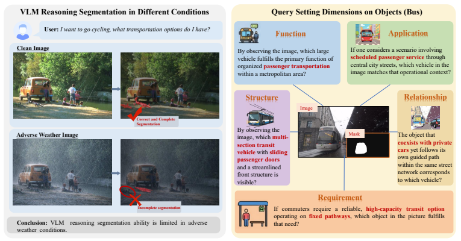
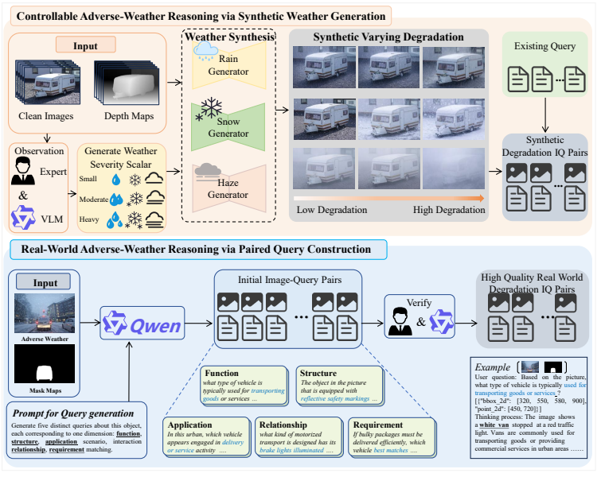
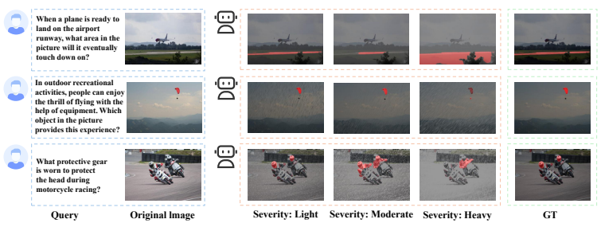
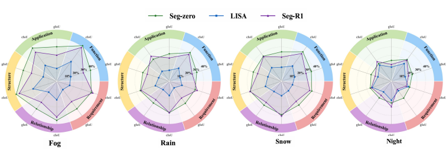

<div align="center">

# WeatherReasonSeg

### A Benchmark for Weather-Aware Reasoning Segmentation in Visual Language Models

**ECCV 2026**

[Wanjun Du](mailto:25110603@bjtu.edu.cn)<sup>1,*</sup> · Zifeng Yuan<sup>2,*</sup> · Tingting Chen<sup>2</sup> · Fucai Ke<sup>3</sup> · Beibei Lin<sup>2,†</sup> · [Shunli Zhang](mailto:slzhang@bjtu.edu.cn)<sup>1,‡</sup>

<sup>1</sup>Beijing Jiaotong University &nbsp;&nbsp; <sup>2</sup>National University of Singapore &nbsp;&nbsp; <sup>3</sup>Monash University

<sup>*</sup>Equal contribution &nbsp;&nbsp; <sup>†</sup>Project leader &nbsp;&nbsp; <sup>‡</sup>Corresponding author

[](https://arxiv.org/abs/2603.17680)
[](https://huggingface.co/datasets/wanwan1111/WeatherReasonSeg)
[](https://eccv.ecva.net/)
[](#benchmark-at-a-glance)

</div>

<p align="center">
  
</p>

> **Can vision-language models still reason and segment reliably when rain, snow, fog, or darkness obscures the visual evidence?**

WeatherReasonSeg is the first benchmark dedicated to **reasoning-based segmentation under adverse weather**. It combines controllable, physics-guided weather synthesis with real-world degraded scenes and pixel-level masks, turning adverse weather into a graded stress test for visual-language reasoning.

## News

- **2026-03** — Paper released on [arXiv](https://arxiv.org/abs/2603.17680).
- **2026** — WeatherReasonSeg accepted to **ECCV 2026**.
- **Dataset available** — The public benchmark is hosted on [Hugging Face](https://huggingface.co/datasets/wanwan1111/WeatherReasonSeg).

## Benchmark at a Glance

| | Synthetic benchmark | Real-world benchmark |
|---|---:|---:|
| Image-query pairs | **8,811** | **35,910** |
| Conditions | Fog, rain, snow | Fog, rain, snow, night |
| Severity control | Light / moderate / heavy | Naturally occurring degradation |
| Query design | Existing reasoning queries | Five structured reasoning dimensions |
| Annotation | Masks and reasoning queries | Masks, boxes and mask-guided queries |

**44,721 image-query pairs in total**, with both bounding-box and pixel-level mask supervision. The benchmark supports reasoning segmentation, referring segmentation, pixel-level vision-language grounding, and robustness evaluation.

## Why WeatherReasonSeg?

Most reasoning-segmentation benchmarks assume clean, high-quality images. WeatherReasonSeg closes the gap between idealized evaluation and real-world deployment by testing whether a model can:

1. understand a natural-language query that requires semantic reasoning;
2. ground the intended object despite degraded visual evidence; and
3. produce an accurate pixel-level segmentation mask.

Our experiments reveal that low-level visual corruption propagates into high-level semantic association and spatial grounding. The result is not merely noisier masks—the reasoning process itself becomes less reliable.

## Dataset Construction

<p align="center">
  
</p>

WeatherReasonSeg contains two complementary components:

- **Controllable adverse-weather reasoning.** Clean ReasonSeg images are transformed using physically interpretable fog, rain, and snow models. Each weather type is rendered at light, moderate, and heavy severity, enabling fine-grained robustness analysis while preserving the original queries and masks.
- **Real-world adverse-weather reasoning.** Real degraded scenes are paired with pixel-level masks. A mask-guided LLM generates object-consistent questions, followed by human-model collaborative filtering for semantic alignment, answerability, and reasoning validity.

### Five reasoning dimensions

| Dimension | What the query tests | Example focus |
|---|---|---|
| **Function** | The object's intrinsic purpose or affordance | What regulates traffic flow? |
| **Application** | The context in which the object is used | What serves scheduled urban transit? |
| **Structure** | Observable attributes and composition | What has sliding doors and a streamlined front? |
| **Relationship** | Spatial or interactive relations | What shares the road while following a guided path? |
| **Requirement** | Mapping a practical need to a suitable object | What offers high-capacity transport on fixed routes? |

## Dataset Statistics

| Subset | Condition | Pairs |
|---|---|---:|
| Synthetic | Fog | 2,937 |
| Synthetic | Rain | 2,937 |
| Synthetic | Snow | 2,937 |
| Real world | Fog | 7,465 |
| Real world | Rain | 8,680 |
| Real world | Snow | 9,545 |
| Real world | Night | 10,220 |
| **Total** | | **44,721** |

> The paper reports 44,721 benchmark image-query pairs. The Hugging Face Dataset Viewer may show a larger row count because the hosted release exposes additional organized variants/shards. Please use the paper statistics when reporting the benchmark scale.

## Download and Quick Start

### Hugging Face Datasets

```python
from datasets import load_dataset

dataset = load_dataset("wanwan1111/WeatherReasonSeg")
print(dataset)

sample = dataset["train"][0]
image = sample["image"]
query = sample["text"]
mask = sample["mask"]
```

Each hosted example includes an adverse-weather image, a natural-language reasoning query, a target mask, and sample identifiers. Check the live [dataset card and viewer](https://huggingface.co/datasets/wanwan1111/WeatherReasonSeg) for the exact schema of the current release.

### Repository layout

The public release is organized around synthetic and real-world subsets:

```text
dataset/
├── syn/
│   ├── val/{cfog,crain,csnow}/
│   └── test/
│       ├── cfog_{light,moderate,heavy}/
│       ├── crain_{light,moderate,heavy}/
│       └── csnow_{light,moderate,heavy}/
└── real/
    ├── train/
    └── val/
        ├── fog/   fog_s1/   ... fog_s5/
        ├── rain/  rain_s1/  ... rain_s5/
        ├── snow/  snow_s1/  ... snow_s5/
        └── night/ night_s1/ ... night_s5/
```

For real-world data, `s1`–`s5` correspond to **Function, Application, Structure, Relationship, and Requirement**, respectively. Base weather folders contain mixed queries sampled from all five dimensions.

## Evaluation

Following prior reasoning-segmentation work, WeatherReasonSeg reports:

- **gIoU** — the mean of per-image Intersection-over-Union scores, weighting images equally;
- **cIoU** — cumulative intersection divided by cumulative union.

The paper evaluates grounding- and reasoning-based systems including Grounded-SAM, GLaMM, PixelLM, LISA, Seg-R1, and Seg-Zero. SAM2 prompted with ground-truth spatial locations is used as a perception upper bound on the real-world benchmark.

## Key Findings

### 1. Robustness decreases monotonically with weather severity

<p align="center">
  
</p>

Across models and metrics, performance consistently declines from clean to light, moderate, and heavy degradation. For the reasoning-only Seg-Zero setting, gIoU drops from **65.3** on clean images to **47.7** under severe weather—an absolute decline of **17.6 points**.

### 2. Reasoning is a major bottleneck in real adverse weather

On real-world scenes, SAM2 with ground-truth spatial prompts reaches **74.8–82.2 gIoU** across weather conditions. The best evaluated reasoning-segmentation model reaches only **28.9–40.6 gIoU**, leaving a substantial gap between perception with known locations and language-guided reasoning.

### 3. Not all reasoning dimensions are equally robust

<p align="center">
  
</p>

Queries grounded in visible **Structure** and **Function** cues are generally more stable. Context-dependent **Application** and **Requirement** queries degrade more strongly, showing that adverse weather disproportionately disrupts higher-level contextual reasoning.

## Paper and Supplementary Material

- [Paper (local PDF)](WeatherReasonSeg_camera_ready.pdf)
- [Supplementary material (local PDF)](Supplementary_Material_WeatherReasonSeg.pdf)
- [arXiv:2603.17680](https://arxiv.org/abs/2603.17680)
- [Hugging Face dataset](https://huggingface.co/datasets/wanwan1111/WeatherReasonSeg)

The supplementary material documents the physics-guided rain, fog, and snow synthesis models, severity parameters, query-generation prompt, annotation rules, quality-control protocol, and additional qualitative and quantitative results.

## Citation

If WeatherReasonSeg is useful in your research, please cite:

```bibtex
@inproceedings{du2026weatherreasonseg,
  title     = {WeatherReasonSeg: A Benchmark for Weather-Aware Reasoning Segmentation in Visual Language Models},
  author    = {Du, Wanjun and Yuan, Zifeng and Chen, Tingting and Ke, Fucai and Lin, Beibei and Zhang, Shunli},
  booktitle = {European Conference on Computer Vision (ECCV)},
  year      = {2026}
}
```

## Acknowledgements

WeatherReasonSeg builds on prior resources including ReasonSeg and ACDC. We thank the authors and maintainers of the evaluated grounding, segmentation, and vision-language models for making their work available to the community.

---

<div align="center">

**WeatherReasonSeg — reasoning through the weather, down to the pixel.**

</div>
